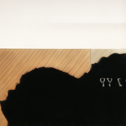

# Lance-3B-MLX

First native [MLX](https://github.com/ml-explore/mlx) port of [ByteDance Research's Lance](https://huggingface.co/bytedance-research/Lance) — a 3B-parameter unified multimodal model for image/video generation, editing, and understanding. Runs natively on Apple Silicon, no CUDA required.

The architecture is **Qwen2.5-VL-3B + parallel MoE-gen experts + Wan 2.2 VAE**. Lance uses a "Mixture-of-Tokens" routing: every attention block and MLP has a parallel `*_moe_gen` branch. Text tokens go through normal weights; VAE-latent (generation) tokens go through the `_moe_gen` weights, in the same forward pass.

## What works

| Capability | Status |
|---|---|
| Text-to-image (T2I), single image, CFG | ✅ Working, verified |
| Strict load of all 1021 LLM/adapter tensors | ✅ Working |
| Wan 2.2 VAE encode/decode (T=1) | ✅ Working (uses [RockTalk/Wan2.2-VAE-MLX](https://huggingface.co/RockTalk/Wan2.2-VAE-MLX)) |
| Flow-matching denoising loop | ✅ Working |
| Classifier-free guidance | ✅ Working |
| 3D mrope position embeddings | ✅ Working |
| MoE-gen routing (per-token attention + MLP + layernorm) | ✅ Working |
| Text-to-video (T2V) | ✅ Working on [Lance-3B-Video-MLX](https://huggingface.co/RockTalk/Lance-3B-Video-MLX) (verified at T_lat=3, 9 frames @ 256×256) |
| X→T (image understanding) | ✅ Working — accurate captioning at ~29 tok/s with KV cache |
| Image editing (TI2I) | ✅ Working — ViT + VAE dual conditioning, Lance chat template, three-component CFG (cfg_text + cfg_vit). Semantic edits verified (color change, object addition). |

## Sample generations

### T2I — text to image

Verified on M4 Studio (128 GB). 30 steps, CFG=4, 512×512:

| Prompt | Output |
|---|---|
| *"a photo of a sunset over mountains"* |  |
| *"a fluffy orange cat sitting on a wooden chair, photorealistic"* |  |
| *"a majestic snowy mountain peak with a dramatic blue sky and clouds"* |  |

### TI2I — image editing

End-to-end edit pipeline: input image → ViT (UND tokens) + VAE-encode (cond latent) → Lance edit-mode chat template → three-component CFG flow-matching → VAE decode.

Three-component CFG (mirrors PT Lance): `v_final = v_tv_uncond + cfg_text * (v_full - v_t_uncond) + cfg_vit * (v_t_uncond - v_tv_uncond)`. CFG settings: `cfg_text=3.0, cfg_vit=1.0`. ~1.5 s/step at 256² (three forward passes per step), 24 steps ≈ 37 s.

| Input | Instruction | Output |
|---|---|---|
|  | *"Add a small red bow tie to the cat."* |  |
|  | *"Make the cat completely black, like a panther."* |  |

### X→T — image understanding

Same M4 Studio. AR generation with KV cache, ~29 tok/s. Question: *"Describe this image briefly."*

| Image | Generated description |
|---|---|
|  | *"The image shows orange cats sitting closely together on a wooden surface. The wooden surface has a warm, orange hue that complements the color of the cats."* |
|  | *"A majestic, snow-covered mountain peak. The mountain is partially shrouded in clouds, creating a dramatic and ethereal atmosphere..."* |
|  | *"A stunning sunset over a mountain range, with the sky painted in rich hues of orange, red, and yellow. The sun is just below the horizon, casting a warm glow..."* |

## Performance

Measured on M4 Studio (128 GB) at CFG=4 (one conditional + one unconditional forward per step):

| Mode | Resolution × Frames | Steps | Per-step | Total | Notes |
|---|---|---|---|---|---|
| T2I  | 256×256 × 1 | 24 | ~400 ms | ~9.6 s | CFG=4 |
| T2I  | 512×512 × 1 | 30 | ~1.2 s  | ~36 s  | CFG=4 |
| TI2I | 256×256 × 1 | 24 | ~1.5 s  | ~37 s  | 3-component CFG (3 forwards/step) |
| X→T  | 504×504 input | — | ~30 tok/s | ~2 s for 60 tokens | KV cache active |

First-call kernel-compile penalty: ~few seconds per new resolution.

## Files

| File | Size | Description |
|---|---|---|
| `model.safetensors` | 23 GB | LLM (Qwen2.5-VL with MoE-gen) + Lance adapters, 1021 tensors |
| `vit.safetensors` | 1.25 GB | Qwen2.5-VL ViT (used by X→T and TI2I) |
| `vae.safetensors` | 2.62 GB | Wan 2.2 VAE (older keying — for compatibility; the standalone [RockTalk/Wan2.2-VAE-MLX](https://huggingface.co/RockTalk/Wan2.2-VAE-MLX) is recommended) |
| `config.json` | — | Distilled architecture config |
| `tokenizer.json`, `vocab.json`, `merges.txt` | — | Qwen2.5-VL tokenizer, verbatim |
| `samples/*.png` | — | Verified outputs (T2I + TI2I edit) from this checkpoint |

## Usage

Requires `mlx >= 0.29`, `mlx-vlm >= 0.3`, `numpy`, `einops`, `transformers`, `pillow`, and the [`lance-mlx`](https://github.com/RockTalk/Lance-MLX) companion repo for the `Lance` Python class.

```bash
pip install mlx mlx-vlm numpy einops transformers pillow
```

```python
import mlx.core as mx
from lance_mlx.lance import Lance, LanceConfig
from lance_mlx.vae_wan22 import Wan2_2_VAE

# Build + strict-load (see tools/lance_t2i.py in the companion repo for the
# full builder; LanceConfig takes a Qwen2.5-VL ModelConfig built from
# config.json).
model = Lance(lance_cfg)
model.load_weights(list(mx.load("model.safetensors").items()), strict=True)

vae = Wan2_2_VAE(z_dim=48, c_dim=160, dim_mult=(1, 2, 4, 4),
                 temperal_downsample=(False, True, True))
vae.model.load_weights(list(mx.load("vae.safetensors").items()), strict=True)

# Sample
latent = model.sample_t2i(
    prompt_token_ids=text_ids,                  # (P,) int32 from tokenizer (no specials)
    latent_shape=(1, 32, 32),                   # (T_lat, H_lat, W_lat) for 512×512 image
    special_token_ids={"bos": 151644, "eos": 151645,
                       "start_of_image": 151652, "end_of_image": 151653,
                       "image_token_id": 151655},
    num_steps=30, timestep_shift=3.5, cfg_scale=4.0, seed=0,
)
img = vae.decode(latent)                        # (1, 1, 512, 512, 3) in [-1, 1]
```

End-to-end script: `tools/lance_t2i.py` in the [companion repo](https://github.com/RockTalk/Lance-MLX).

## How the MoE-gen routing is implemented in MLX

Lance's checkpoint contains *two* sets of weights per Qwen2 block:

```
self_attn.{q,k,v,o}_proj         self_attn.{q,k,v,o}_proj_moe_gen
self_attn.{q,k}_norm             self_attn.{q,k}_norm_moe_gen
mlp.{gate,down,up}_proj          mlp_moe_gen.{gate,down,up}_proj
input_layernorm                  input_layernorm_moe_gen
post_attention_layernorm         post_attention_layernorm_moe_gen
```

Each mode has its own sequence layout. The MLX port (`qwen2_navit_mlx.py`) routes by slicing the sequence into the GEN slab vs the surrounding UND text/vision, applying the appropriate expert to each slab, and concatenating.

**T2I / T2V** — text prompt then target noise:
```
<|im_start|> [prompt] <|im_end|> <|vision_start|> [N latent placeholders] <|vision_end|>
                                                  └──── routed through moe_gen ────┘
```

**X→T (understanding)** — image then text question, autoregressive answer:
```
<|im_start|>system\n[Lance sys]<|im_end|>\n<|im_start|>user\n
  <|vision_start|>[N_vit placeholders]<|vision_end|>[question]
<|im_end|>\n<|im_start|>assistant\n[AR generated tokens...]
```
All tokens route through normal weights. Per-layer KV cache for the AR loop. Image positions inside `<|vision_start|>..<|vision_end|>` use 3D mrope grid coords (h_patches/sms × w_patches/sms).

**TI2I (editing)** — input image (ViT + VAE-cond) + instruction → target noise:
```
<|im_start|>system\n[Lance edit-mode sys]<|im_end|>\n<|im_start|>user\n
  <|vision_start|>[N_vit placeholders]<|vision_end|>[instruction]
<|im_end|>\n<|im_start|>assistant\n
  <|vision_start|>[N_cond VAE-latent placeholders]<|vision_end|>
  <|vision_start|>[N_tgt noise placeholders]<|vision_end|>
                  └──── routed through moe_gen ────┘
```
ViT tokens and VAE-cond tokens use normal weights; only the target-noise block uses `moe_gen`. The Lance edit-mode system prompt is verbatim from PT and is required for the model to recognize edit intent. Three-component CFG (`cfg_text`, `cfg_vit`) gives separate control over text vs visual conditioning strength.

## Conversion source

Converted from `bytedance-research/Lance/Lance_3B/*` using the open-source pipeline at https://github.com/RockTalk/Lance-MLX (`tools/convert_weights.py`). Layout transforms:

- Conv weights: PT `(O, I, [T,] H, W)` → MLX `(O, [T,] H, W, I)`
- Embedding weights: shape preserved
- `lm_head.weight` tied to `embed_tokens.weight` (Qwen default)
- All `*_moe_gen.*` keys copied verbatim under the same names

## License

Apache 2.0, inherited from upstream `bytedance-research/Lance`. The Wan 2.2 VAE component is also Apache 2.0 from Alibaba's Wan team.

## Acknowledgements

- **ByteDance Research** — original Lance training + PT release
- **Qwen team** — Qwen2.5-VL-3B-Instruct backbone
- **Alibaba Wan team** — Wan 2.2 VAE training
- **Apple `mlx` and `mlx-vlm` teams** — the underlying frameworks
- **This MLX port** — RockTalk

## Citation

```bibtex
@misc{lance_mlx,
  title  = {Lance-3B-MLX — First MLX port of ByteDance's Lance},
  author = {RockTalk},
  year   = {2026},
  url    = {https://huggingface.co/RockTalk/Lance-3B-MLX}
}
```
