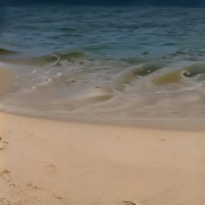

# Lance-3B-Video-MLX

Video variant of [Lance-3B-MLX](https://huggingface.co/RockTalk/Lance-3B-MLX). First native [MLX](https://github.com/ml-explore/mlx) port of [ByteDance Research's Lance](https://huggingface.co/bytedance-research/Lance) — a 3B-parameter unified multimodal model for image/video generation, editing, and understanding. Runs natively on Apple Silicon, no CUDA required.

The architecture is **Qwen2.5-VL-3B + parallel MoE-gen experts + Wan 2.2 VAE**. Lance uses a "Mixture-of-Tokens" routing: every attention block and MLP has a parallel `*_moe_gen` branch. Text tokens go through normal weights; VAE-latent (generation) tokens go through the `_moe_gen` weights, in the same forward pass.

## What works

| Capability | Status |
|---|---|
| Text-to-video (T2V) | ✅ Working — verified at T_lat=3 (9 frames @ 256×256) using Wan 2.2 VAE v0.1.0 streaming cache |
| Text-to-image (T2I) | ✅ Working (same code path as T2V with T_lat=1) |
| X→T (image understanding) | ✅ Working — same code path as in [Lance-3B-MLX](https://huggingface.co/RockTalk/Lance-3B-MLX), ViT weights bundled in `model.safetensors` under `vit_model.*` |
| TI2I (image editing) | ✅ Working — same code path as in [Lance-3B-MLX](https://huggingface.co/RockTalk/Lance-3B-MLX) |
| TIV2V (text + image → video edit) | ⚠ Architecture in place — extension of TI2I with T_lat>1, untested |
| Strict load of all 1021 LLM/adapter tensors (+ 390 ViT) | ✅ Working |
| Wan 2.2 VAE encode/decode (T=1 and T>1 streaming) | ✅ Working (uses [RockTalk/Wan2.2-VAE-MLX](https://huggingface.co/RockTalk/Wan2.2-VAE-MLX)) |
| Flow-matching + 3-component CFG + MoE-gen routing + 3D mrope | ✅ Working |

## Sample generations

### Text-to-video (T2V)

Verified on M4 Studio (128 GB). 24 steps, CFG=4, 256×256, T_lat=3 → 9 frames:

*"a calm ocean wave rolling onto a sandy beach"* — 9-frame strip (left-to-right):


Single frames (frame 0, 4, 8):

| Frame 0 | Frame 4 | Frame 8 |
|---|---|---|
|  |  |  |

## Performance

Measured on M4 Studio (128 GB) at CFG=4 (one conditional + one unconditional forward per step):

| Mode | Resolution × Frames | Steps | Per-step | Total sample | VAE decode |
|---|---|---|---|---|---|
| T2I | 256×256 × 1 | 24 | ~400 ms | ~9.6 s | ~0.1 s |
| T2I | 512×512 × 1 | 30 | ~1.2 s  | ~36 s | ~0.5 s |
| T2V | 256×256 × 9 (T_lat=3) | 24 | ~900 ms | ~22 s | ~0.9 s |

First-call kernel-compile penalty: ~few seconds per new resolution.

## Differences vs Lance-3B-MLX

This is the same architecture as the image variant, with two differences:
- `model.safetensors`: 26.5 GB (vs 23 GB) — extra weights for multi-frame attention
- `latent_pos_embed.pos_embed`: 31 × 64 × 64 = 126,976 positions (vs 1 × 64 × 64 = 4,096) — supports up to 31 latent frames (≈ 121 video frames @ 4× temporal downsample)

T2I via this checkpoint works the same as Lance-3B-MLX. **T2V is now live** — uses the [Wan 2.2 VAE v0.1.0 streaming cache](https://huggingface.co/RockTalk/Wan2.2-VAE-MLX) under the hood. Pass `latent_shape=(T_lat, H_lat, W_lat)` with `T_lat > 1` to `sample_t2i` to generate a video.

T_lat → output frames: T = (T_lat - 1) × 4 + 1.
- T_lat=1 → 1 frame (image)
- T_lat=3 → 9 frames
- T_lat=8 → 29 frames
- T_lat=31 → 121 frames (max for this checkpoint)

## Files

| File | Size | Description |
|---|---|---|
| `model.safetensors` | 26.5 GB | LLM (Qwen2.5-VL with MoE-gen) + Lance adapters + bundled ViT (`vit_model.*` prefix), 1411 tensors total |
| `vit.safetensors` | 1.25 GB | Qwen2.5-VL ViT, also extractable from `model.safetensors` |
| `vae.safetensors` | 2.62 GB | Wan 2.2 VAE (older keying — for compatibility; the standalone [RockTalk/Wan2.2-VAE-MLX](https://huggingface.co/RockTalk/Wan2.2-VAE-MLX) is recommended) |
| `config.json` | — | Distilled architecture config |
| `tokenizer.json`, `vocab.json`, `merges.txt` | — | Qwen2.5-VL tokenizer, verbatim |
| `samples/ocean_wave_*.png` | — | Verified 9-frame T2V outputs |

## Usage

Requires `mlx >= 0.29`, `mlx-vlm >= 0.3`, `numpy`, `einops`, `transformers`, `pillow`, and the [`lance-mlx`](https://github.com/RockTalk/Lance-MLX) companion repo for the `Lance` Python class.

```bash
pip install mlx mlx-vlm numpy einops transformers pillow
```

```python
import mlx.core as mx
from lance_mlx.lance import Lance, LanceConfig
from lance_mlx.vae_wan22 import Wan2_2_VAE

# Build + strict-load (see tools/lance_t2i.py in the companion repo for the
# full builder; LanceConfig takes a Qwen2.5-VL ModelConfig built from
# config.json).
model = Lance(lance_cfg)
model.load_weights(list(mx.load("model.safetensors").items()), strict=True)

vae = Wan2_2_VAE(z_dim=48, c_dim=160, dim_mult=(1, 2, 4, 4),
                 temperal_downsample=(False, True, True))
vae.model.load_weights(list(mx.load("vae.safetensors").items()), strict=True)

# Sample
latent = model.sample_t2i(
    prompt_token_ids=text_ids,                  # (P,) int32 from tokenizer (no specials)
    latent_shape=(1, 32, 32),                   # (T_lat, H_lat, W_lat) for 512×512 image
    special_token_ids={"bos": 151644, "eos": 151645,
                       "start_of_image": 151652, "end_of_image": 151653,
                       "image_token_id": 151655},
    num_steps=30, timestep_shift=3.5, cfg_scale=4.0, seed=0,
)
img = vae.decode(latent)                        # (1, 1, 512, 512, 3) in [-1, 1]
```

End-to-end script: `tools/lance_t2i.py` in the [companion repo](https://github.com/RockTalk/Lance-MLX).

## How the MoE-gen routing is implemented in MLX

Lance's checkpoint contains *two* sets of weights per Qwen2 block:

```
self_attn.{q,k,v,o}_proj         self_attn.{q,k,v,o}_proj_moe_gen
self_attn.{q,k}_norm             self_attn.{q,k}_norm_moe_gen
mlp.{gate,down,up}_proj          mlp_moe_gen.{gate,down,up}_proj
input_layernorm                  input_layernorm_moe_gen
post_attention_layernorm         post_attention_layernorm_moe_gen
```

For T2I/T2V the sequence layout is:

```
<|im_start|> [prompt tokens] <|im_end|> <|vision_start|> [N latent placeholders] <|vision_end|>
                                                          └──── routed through moe_gen ────┘
                                                          ↑ everything else: normal weights
```

The MLX port (`qwen2_navit_mlx.py`) routes by slicing the sequence into the latent slab vs the surrounding text, applying the appropriate expert to each slab, and concatenating. mrope position ids continue to flow normally across both slabs (with axis-T/H/W coordinates only varying inside the latent slab).

## Conversion source

Converted from `bytedance-research/Lance/Lance_3B/*` using the open-source pipeline at https://github.com/RockTalk/Lance-MLX (`tools/convert_weights.py`). Layout transforms:

- Conv weights: PT `(O, I, [T,] H, W)` → MLX `(O, [T,] H, W, I)`
- Embedding weights: shape preserved
- `lm_head.weight` tied to `embed_tokens.weight` (Qwen default)
- All `*_moe_gen.*` keys copied verbatim under the same names

## License

Apache 2.0, inherited from upstream `bytedance-research/Lance`. The Wan 2.2 VAE component is also Apache 2.0 from Alibaba's Wan team.

## Acknowledgements

- **ByteDance Research** — original Lance training + PT release
- **Qwen team** — Qwen2.5-VL-3B-Instruct backbone
- **Alibaba Wan team** — Wan 2.2 VAE training
- **Apple `mlx` and `mlx-vlm` teams** — the underlying frameworks
- **This MLX port** — RockTalk

## Citation

```bibtex
@misc{lance_mlx,
  title  = {Lance-3B-MLX — First MLX port of ByteDance's Lance},
  author = {RockTalk},
  year   = {2026},
  url    = {https://huggingface.co/RockTalk/Lance-3B-MLX}
}
```
